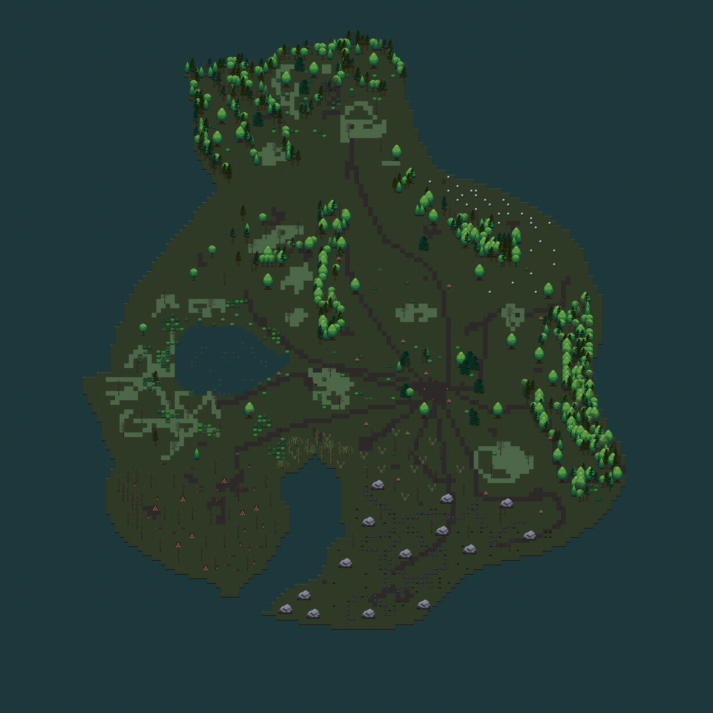

# **ARBIUS - Fire by Night**.
*Game development document - EN*.

This repository contains the implementation of the project from the course **Object Technologies** - the game **Arbius - Fire at Night**. In the game, the player controls a hero who must survive on a desert island, fight the cold and other dangers, collect firewood to make a fire and overcome obstacles. The game combines elements of strategic planning, dynamic events and retro atmospheric graphics.

**Author**: *Ivan Veremchuk*

**Project theme**: *Darkness and Light.*

---

## **1. Introduction.**

**1.1 Idea and inspiration**.

**The Arbius - Fire at Night project was created as a final project in the subject of Object Technologies. The main idea is to survive in a nighttime, gloomy world where the cold and harsh environment force the hero to constantly move forward, gathering limited resources to keep the fire burning. Inspired by classic works of darkness and light, as well as indie games where atmosphere and precise interaction with the environment are key aspects.

### **1.2 Game Overview**.

The player is faced with the following tasks:
- **Survive the night**: Survive a long, cold night.
- **Collect resources**: Collect logs to make a fire. The amount of firewood available gradually decreases with each successive level, creating an additional challenge.
- **Fight the Cold**: The cold intensifies throughout the level, so the hero must light the fire in time or look for bright places to stay warm.
- **Dynamic events**: Storms and other random events change the conditions of the game, affecting the speed of freezing of the hero and the reduction of the fire.
- **Swamp mechanics**: When the hero enters the swamp, his speed is significantly reduced, making it difficult to move and requiring careful route planning.

## **1.3 Development Software**.
- **Pygame-CE**: free software language.
- **PyCharm 2024.1**: IDE released.
- **Tiled 1.10.2**: graphical level designer for displaying levels.
- **Itch.io**: graphic assets and sounds.

---
## **2. Concept**.

### **2.1 Gameplay Overview**

**Arbius – Fire at Night** is an atmospheric game with survival elements. The player must:
- Move through different levels, each with its own characteristics (including resource depletion, dynamic events and swamp areas).
- Collect limited resources (logs) to maintain a fire that helps fight the cold.
- Plan your actions to keep warm in time and prevent the hero from freezing.

### **2.2 Theme Interpretation: Dark and Light**

The game explores the struggle between light and darkness:
- **Light** symbolizes the warmth, life, hope and power of the fire that supports the hero's life.
- **Darkness** represents the cold, danger and harsh, hostile environment.
- The player must use light as a tool for survival, confronting the darkness.

---

## **3. Art**

### **3.1 Theme Interpretation (Dark and Light)**
The game aims to be visually appealing with carefully selected assets that emphasize the contrast between light and darkness. Using assets from itch.io, assets were selected for the protagonist and environmental elements that convey the atmosphere of gloom, cold night and the struggle for survival. The protagonist symbolizes warmth and hope, while the dark, harsh environment reflects the dangers and trials he faces.

 
<em>Hero Concept Preview</em>

### **3.2 Design.**

A paid package was used as the main asset for the environment:
🔗 [sprout-lands-asset-pack](https://cupnooble.itch.io/sprout-lands-asset-pack).

The game uses assets that match the theme of medieval fantasy and survival. Resources from itch.io, in particular pixel art sets, help create a unique environment on an uninhabited island. The main focus is on the following elements:
- **Background tiles**: The map is created in the Tiled editor and contains several layers that form the basis of the world (water, base, swamp, decor).
- **Level objects**: Additional elements (logs, stones, trees) are adapted to create a gloomy but detailed atmosphere.
- **Decorative elements**: Carefully selected objects that not only decorate the level, but also perform a functional role (for example, create obstacles or contribute to the correct operation of the collision system).

 
<em>Level design concept</em>

### **3.4 Polygons and Collisions**

To accurately determine collisions, a mask system is used that generates polygons (contours) for each sprite.
- This allows you to correctly display the interaction of objects, in particular, the exact selection of resources and interaction with decorative elements.
- Polygon correction system ensures that the sprite outline matches its visual model.

---

## **4. Audio**

### **4.1 Music**

Each stage of the game is accompanied by music that matches the atmosphere:
- **Start Menu**: Melodies that immerse you in the world of the game.
- Main Game: Atmospheric compositions that emphasize the tension and gloom of the night world.
- Level Transitions and Victory Screen**: Specially selected music to enhance emotional moments.
- Death Screen: Dramatic soundtracks that signal failure and the importance of timely action.

The source of the music for the levels, the opening screen, the transition screens, the cutscene and the Game Over screen was the sound package:
🔗 [instagram music](https://www.instagram.com/).
---

## **5. Gameplay and Interface**

### **5.1 User Interface**

The game interface includes:
- **Animated Main Menu**: A start menu with interactive animation and the ability to start the game by pressing the Enter key.
- **Status Indicators**:
- **Health Bar** – displays the hero's health.
- **Corruption/Cold Bar** – shows the level of cold that is bringing the hero closer to freezing.
- **Minimap**: Shows the hero's position on the map, the location of key objects (e.g. firewood) and helps navigate the large game world.

### **5.2 Controls**

#### **Keyboard:**
- **A/D** or **Left/Right Arrows** – horizontal movement.
- **W/S** or **Up/Down Arrows** – vertical movement.
- **F** – action, e.g. throwing a log into a fire.
- **ESC** – opens the pause menu.
- **TAB** – switches between levels (for demonstration purposes and debugging).

---

## **6. Advanced Features**

### **6.1 Storm System**

A Storm is a dynamic event that:
- Randomly triggers with a certain probability.
- Increases the rate of decrease in the progress of the hearth and increases the freezing speed of the hero.
- Has its own animation, which is superimposed on the screen with some transparency.

### **6.2 Resource Gathering System**

- **Logs** are located on the map as objects with specified coordinates.
- With each level, the number of available firewood decreases (according to an algorithm using the **reduction** parameter).
- The player can only pick up one log at a time, which affects the strategy and location on the map.

### **6.3 Collision System and Polygons**

- Sprite masks are used to accurately detect collisions.
- Contours (polygons) obtained from masks can be displayed for debugging to ensure their accuracy and coincidence with the visual model of objects.
- The polygon correction system allows you to accurately display the contour of the visual image (e.g. stones, decorative elements).

### **6.4 Swamp Mechanic**

- **Swamp** is an area on the map where the hero's movement is significantly slowed down.
- When entering a swamp, the hero's speed decreases, which affects reaction time and the ability to collect the necessary resources in a timely manner.
- This mechanic adds an additional strategic element, as the player must plan his route, avoiding swamp areas or adapting to slow movement.

---

## **7. Conclusions**

**Arbius – Fire at Night** is an ambitious project that combines carefully crafted graphics, a dynamic event system, and precise mechanics of interaction with the environment. The player is immersed in the gloomy atmosphere of the night world, where each level poses new challenges and requires strategic thinking for survival.

---

*Documentation prepared by Ivan Veremchuk.*
